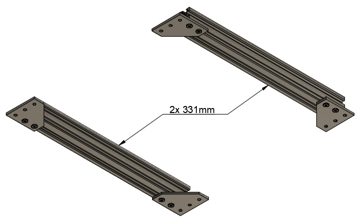
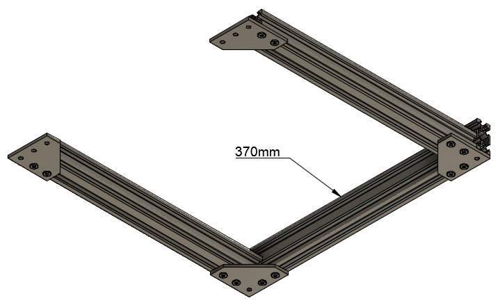
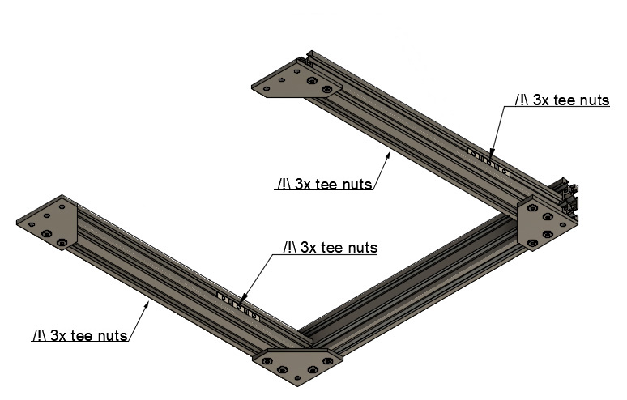

# Prusa i3 Full Upgrade MK3

## Assembly Instructions

### Step 1

#### Parts

* 2x 331mm V-Slots
* 1x 370mm V-Slots
* 4x M5x12mm screws

#### Assembly

1. Assemble loosely a U with the three v-slots.  Do not tighten M5 screws yet.

\
*fig 1.2*

\
*fig 1.3*

\
*fig 1.4*

#### [Next Step](step02.md)
