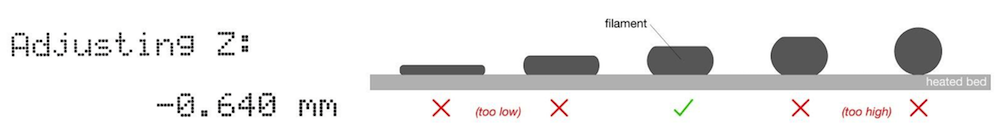
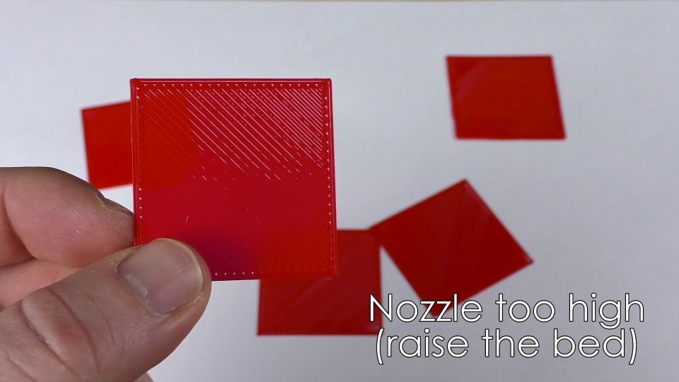
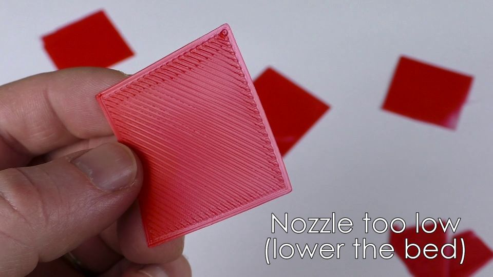
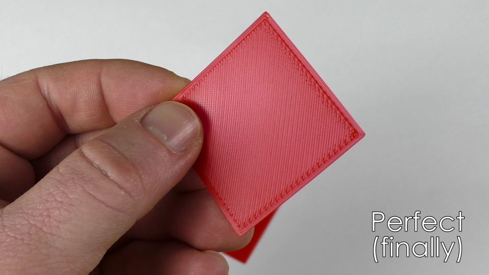

# McP StartUp instructions

## Step 1: Make a PEI covered steel print bed

Get a steel sheet and a piece of PEI to to attach to it.  Clean the sheet as well as you can before applying the plastic.

Here is a video that shows one way to apply the PEI: [PEI attachment] (https://www.youtube.com/watch?v=Zg9LDfDJrDc)

A credit card or similar squeegee can help apply smoothly.

##  Step 2: Get the x axis accurately horizontal

1. Move the extruder to the left until in closes the x endstop switch.
1. Get a spacer, about 2-10 mm thick. (Calipers work ok if you use a part where both sides are flat.)
1. Move the extruder down by turning both threaded rods until the nozzle is just barely touching the spacer with the spacer resting on the bed.  
1. Move the extruder toward the right.  (Don't let the nozzle touch anything.  If it is getting closer to the bed, turn the right threaded rod.)
1. At far right, move the extruder up or down with the right threaded rod until the nozzle is just barely touching the spacer with the spacer resting on the bed.
1. Move the extruder back to the right and repeat until nozzle it exactly at the height of the spacer throughout the whole width of the bed.

##  Step 3: Adjust inductive probe height

1. Loosen the screw holding the inductive sensor (the threaded cylinder with the gray bottom that is right of and behind the nozzle).
1. Adjust the height of the inductive sensor so that it is 0.6mm above the end of the nozzle.  A plastic alignment aid that has a 0.6mm step on it is helpful. 
1. Tighten the screw.
1. Make sure the lowest part of the sensor is visibly higher than the nozzle, but still less than 1mm higher.

## Step 4: Turn on

Plug your machine in.  Turn on the switch.

## Step 5: Explore menus

Try navigating around the menus by turning and pushing the knob.  Try to remember some of the possible selections.

## Step 6: Test 

If the test fails at any point, reset your printer (the button marked X).  Then work to identify and fix the error.

### Test axes

1. Navigate to move x-axis by 10 mm steps (Prepare/Move axis/X-axis/10mm).
1. Turn the knob one click clockwise.  Hand (extruder) should move 10 mm right.
1. Turn the knob one click counterclockwise.  Hand should move back to where it started.
1. Do the same steps for the y-axis.  Bed (belly) should move forward and backward instead.
1. Do the same steps for the z-axis.  Hand should move up and down.

### Test endstops

1. Find "Autohome" in the menus and execute it.  
1. The hand will move left first, press reset if motor doesn't stop when x-endstop is reached.
1. Next, the bed will move. Press reset if motor doesn't stop when y-endstop is reached.
1. Now the hand will move down. Prepare to press reset if the nozzle gets closer than 1mm to the bed.  DO NOT LET THE NOZZLE CONTACT THE BED!

### Add Filament. Test heaters, thermometers, and extruder. 

1. In the prepare menu, select "Preheat PET".
1. Watch to see that the temperature of the extruder and bed rise.  The temperature of the inductive sensor (the unlabelled number in the upper right of the LCD screen) should also rise but more slowly and not as much.
1. When the temperature of the extruder is above 230 degrees celsius, choose "Change Filament".  Select a roll of PETG filament and load it when instructed.
1. In the control menu, select "temperature" and then "nozzle".  Turn the nozzle target temperature down to 55 degrees celsius.
1. Using the menus, move the extruder up 10 mm (z-axis).
1. Using tweezers, clean any filament off the nozzle.

## Step 7: Measure bed plane

1. Wait until bed temperature is at target (85 degrees celsius).
1. Record inductive probe temperature.
1. Run Unified Bed Leveling phase 1.
1. Watch to see that nozzle never touches bed.  Procedure will finish in a few minutes.
1. Record inductive probe temperature.  If it differs from temperature recorded before leveling by more than a degree or maybe two, you should repeat this whole procedure (Step 7).
1. Store Bed Mesh.

## Step 8: Z-offset adjust

The inductive sensor will trigger with the nozzle a short distance above the bed.  Now we will manually adjust this to get the height offset correct for your machine.

1. Start the print "ZOffsetAdjust" from the benchmark folder on the SDcard.
1. As soon as the printer beeps, note the inductive probe temperature.
1. Double-click the knob to bring up the "z-offset-adjust" function.
1. Adjust the setting until the nozzle is close to but not touching the bed.
1. The print will start soon.
1. Try to adjust the z-offset to get the layer adhering well and quite smooth.  The bead formed should be somewhat flattened between the bed and the nozzle. 
\
The filament bead should be shaped like this.
1. The layer formed should be connected and quite smooth, so keep adjusting as necessary.
\
Offset not negative enough
\
Offset too negative
\
Offset in Goldilocks zone
1. Repeat Z-offset adjust as necessary.

You can also do this adjustment on the first layer of any print to improve first layer quality.  First layer quality is the most important part of making successful prints.

Unfortunately, this offset is very sensitive to the temperature of the inductive sensor.  Therefore, you will want to make sure that the temperature of the inductive sensor is similar each time the printer measures the bed height (homes z-axis).

## Step 9: IMPORTANT! Save settings.

Navigate to "Store settings" in the control menu and select to store your bed mesh and z-offset adjustment.

## Measure extrusion

You may need to measure if your extruder is extruding the amount of filament that it thinks it is.

1. Preheat for PET and wait until temperature is reached.
1. Make a sharpie mark on the filament about (precision not necessary) 10cm (100mm) above where it enters the extruder.
1. Using calipers, measure the distance along the filament from the top of the extruder to this mark. Record this value. (Precision is necessary.)
1. Go to the setting to move the extruder axis by 10mm steps.
1. Turn the knob one tick clockwise to extrude 10mm of filament.
1. Once the extruder stops turning, measure and record the distance again.
1. Repeat until your mark disappears into the extruder.

If you now make a plot of expected position (0mm, 10mm, 20mm, 30mm, ...) vs. your measured length, the slope will be the factor by which you should multiply the extruder calibration.  Ask for help if you need it. 

  
#### [Previous Step: brain](brain.md) &nbsp;&nbsp;&nbsp; [Next Step: enjoy]
