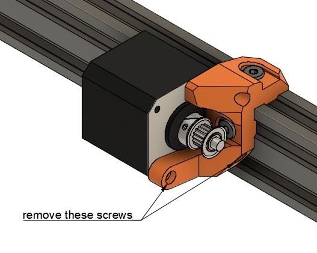

# McP Assembly Instructions: Belly (heated bed)

### Joints y3

#### Parts  

* 1x heated bed assembly (If not assembled yet, see: [Prusa manual y-axis assembly] (https://manual.prusa3d.com/Guide/2.+Y-axis+assembly/507?lang=en) steps 22 through 27)
* 4x zip ties

#### Assembly

:heavy_exclamation_mark: Y belt is not visible in these figures and will not be visible in the following ones

1. Unclip the front of y smooth rods
1. Slide carefully the Y carriage. Ensure correct orientation as highlighted in figure 10.1
1. Clip back Y smooth rods
1. Add zip ties with head facing inside the frame as seen on figure 10.2. Ensure zip ties are not touching the bed and y carriage
1. If the bed does not slide smoothly, improve rod spacing/angle 
   :warning: this step is very important, take your time and check dimensions from previous step.
1. Unscrew 2x M3x10 bottom screws of the y_motor_mount as highlighted in figure 10.3
1. Rotate the motor and mount the Y belt
1. Find the correct tension for the belt. You can use the Prusa MK3 method from the original manual here : [Step 37 Testing the Y-axis belt](http://manual.prusa3d.com/Guide/2.+Y-axis+assembly/507?lang=en#s8300)
1. Screw the motor back
1. Take your time to perfectly align y_idler and y_motor_mount to get a good belt alignment

\
*fig 10.1*

\
*fig 10.2*

\
*fig 10.3*

## Supplies

1. Heatbed MK52
1. 300mm of 5mm cable sleeve (the smaller diameter sleeve)
1. Heatbed_cable_cover

## Heatbed assembly

Follow the Prusa instructions: [Prusa manual heatbed assembly](https://manual.prusa3d.com/Guide/7.+Heatbed++&+PSU+assembly+(textile+sleeve)/589?lang=en)

You will be done after step 17. 

## X cable sleeve

Since you just learned how to attach a cable sleeve, you should also attach a cable sleeve to the x_motor.  This step also uses a 300mm long 5mm cable sleeve.  Both the x_motor cable and the x_endstop cable will route through this sleeve.  Secure the sleeve with a cable tie near the x_motor once you are finished.

#### [Previous Step: feet](feet.md) &nbsp;&nbsp;&nbsp; [Next Step: wrist](wrist.md)
