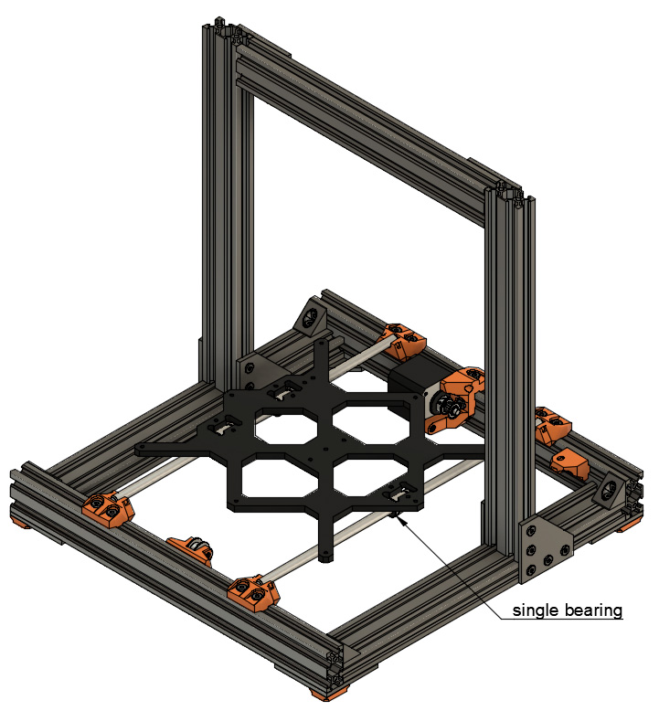
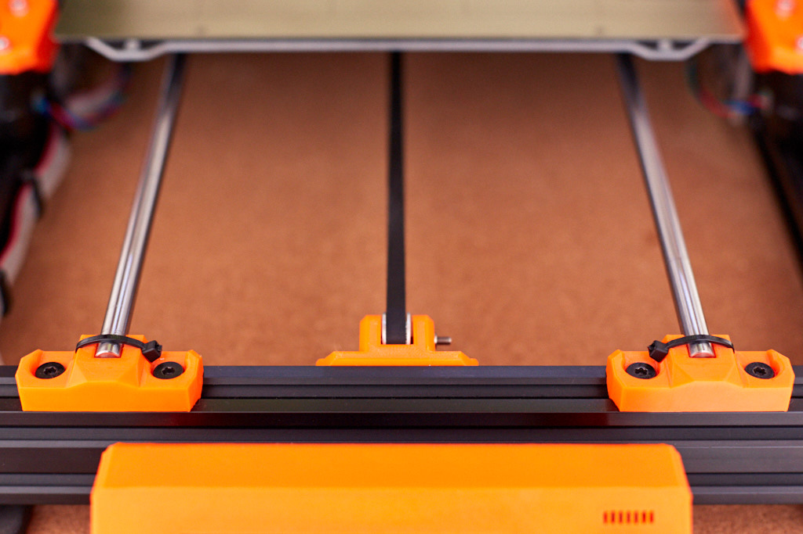

# McP Assembly Instructions: Belly (heated bed)

## Joints y3: Assemble Y carriage and belt

### Parts  

* 1x Y carriage
* 4x zip ties
* 665mm GT2 belt

### Assembly

:heavy_exclamation_mark: Y belt is not visible in these figures and will not be visible in the following ones

1. Ensure correct orientation of the Y carriage as highlighted in figure 10.1

1. Add zip ties with head facing inside the frame as seen on figure 10.2. Ensure zip ties are not touching the bed and y carriage
1. If the bed does not slide smoothly, improve rod spacing/angle 
   :warning: this step is very important, take your time and check dimensions from previous step.
1. Loosen, by several turns, the screws holding the y-tensioner.  You will tighten these later to get correct tension in the belt.
1. Mount the Y belt.
1. Take your time to perfectly align y_idler and y_motor_mount to get a good belt alignment
1. Tighten the y_idler mount to get the correct tension for the belt. You can use the Prusa MK3 method from the original manual here : [Step 37 Testing the Y-axis belt](http://manual.prusa3d.com/Guide/2.+Y-axis+assembly/507?lang=en#s8300)

\
*fig 10.1*

\
*fig 10.2*

## Heatbed cable

### Supplies

1. 400mm of 14 gauge dual conductor cable
1. 2x blue (#16-14 AWG) ring terminal

### Instructions

1. Strip about 4 mm of one end of one conductor in your cable.
1. Twist the exposed wire with for fingers.
1. Insert wire into ring terminal
1. Crimp strongly with oval shaped crimping die.
1. Repeat with other conductor on the same end.
1. :heavy_exclamation_mark: The wire with the white stripe will be negative, which appears as black in the Prusa instructions.

## Heatbed assembly

### Supplies

1. Heatbed MK52
1. 350mm of 5mm cable sleeve (the smaller diameter sleeve)
1. Heatbed_cable_cover

### Heatbed assembly

1. 1-12: Follow the Prusa instructions: [Prusa manual heatbed assembly](https://help.prusa3d.com/en/guide/7-heatbed-psu-assembly_172872 )

You will be done after step 12. 

Now mount the heat bed on the y-carriage

Installation/Setup Procedure

Before starting you will need 8x M3 Nylock nuts (aka nylon lock nuts)

1. Move the Z axis to the top, to ensure it doesn't cause an obstruction
1. Put one of the M3 countersunk screws back into one of the holes in the perimeter of the heated bed
1. Put one of the Nylock nuts onto the thread of the nut, on the underside of the bed, making sure of the orientation of the nut (the end with the white nylon visible goes away from the bed, most visible)
1.  Tighten the Nylock nut and screw, using an allen-key/hex-wrench and a 5.5mm wrench or socket
1.    Tighten until the nylock nut just starts to bite down against the bed, so the screw does not turn freely without the nut being held, then back the nut off a tiny amount (1/16th turn or less) so that the screw can be turned, but is not loose
1.   Repeat the above steps for each of the 8 perimeter holes
1.   Place an aluminum spacers over the center hole in the Y carriage
1.   Place the remaining M3 screw through the center hole in the bed
1.  Place the heatbed over the Y carriage, so that the center screw goes into the spacer, and is over the center hole.
1.  Orientate the heatbed so that the screws (held in place by the lock nuts) are each aligned over their respective holes in the Y carriage
1.   Starting with the front-center screw tighten it by one full turn (NOT more than one full turn)
1.   Repeat for each of the perimeter screws in turn, I suggest following a clockwise pattern, turning each screw one full turn at a time.
1.    Repeat the full circle 6-8 times, tightening each screw no more than one full turn at a time, and ensuring that each screw is tightened evenly on each rotation.
1.   Check to see when the bed is sitting loosely on the center spacer (look underneath the bed, using a flashlight/torch if needed). Repeat tightening of each of the perimeter screws until the bed is sitting lightly on the center spacer.
1.   Tighten the center screw. If the screw requires more than one full turn from when the screw starts to bite, for it to become tight, then you may need to further tighten the perimeter screws slightly
1.   Check that a spacer can be fitted snugly between the bed and the Y-carriage near each of the perimeter screws. Adjust each screw as needed in order to be able to fit a spacer. Do not leave the spacer in place, just use it as a height gauge and then remove.
 
## X cable sleeve

Since you just learned how to attach a cable sleeve, you should also attach a cable sleeve to the x_motor.  This step also uses a 450mm long 5mm cable sleeve.  The x_motor cable will route through this sleeve.  Secure the sleeve with a cable tie near the x_motor once you are finished.

#### [Previous Step: feet](feet.md) &nbsp;&nbsp;&nbsp; [Next Step: wrist](wrist.md)
