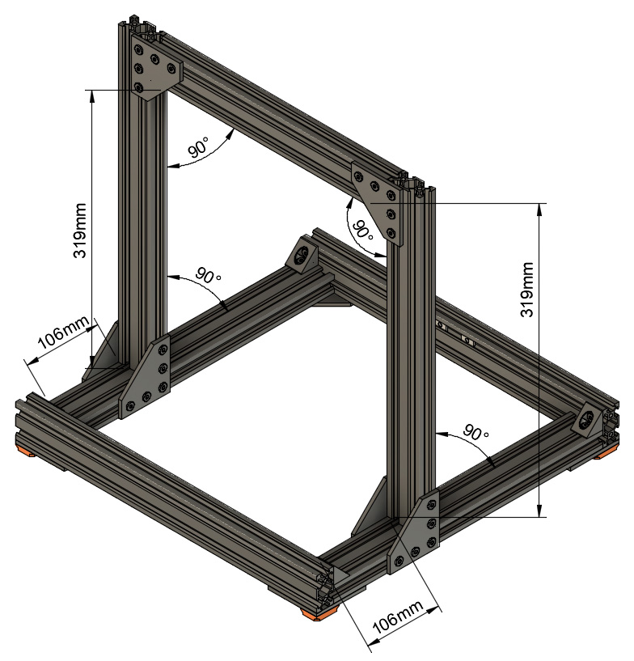

# McP

## Assembly Instructions

### Bones

#### Parts  

* 1x 290mm v-slot
* 2x 396mm v-slots
* 2x 331mm v-slots
* 2x 370mm v-slots
* 16x M5x12mm screws

#### Assembly

1. Insert a screw into each threaded end of each v-slot.  Some ends are not threaded.  You should use all 16 screws.
1. Each screw should be about 3mm from fully screwed in so that each screw can be slid into a v-slot.
1. Slide the pieces together to make the frame shape shown in figure 7.4.
1. Loosely tighten each screw so that the frame doesn't fall apart, but can still be adjusted.
1. Check the base is not twisted by pressing down each corner.
1. If it is twisted, place an object (in red on figure 4.2) under one corner and apply pressure simultaneously to both perpendicular corners (A and B). Repeat this for left and right side until you get a perfectly flat frame.
1. Make sure the base is flat so that all four corners can touch when placed on a flat surface.  If not, place a small flat object under on of the low corners and push down on the 
1. Make sure that each upright is 106mm from the back.
   :warning: important
1. Make sure the uprights are square to the base, in both directions.
   :warning: important
1. Make sure the crossbar is square to the uprights.
1. For improved rigidity, trianglular corner braces should be added at the left and right edges of the upright.  Make sure they are on the back (shorter) side.
1. For more rigidity, more trianglular corner braces can be added.  This step is optional.

\
*fig 7.4* (Beware: there are some differences to this picture.  Some of the connectors will be different or missing.  Also the 319mm dimension will be different.)

\
*fig 4.2*

#### &nbsp;&nbsp;&nbsp; [Next Step](joints.md)
