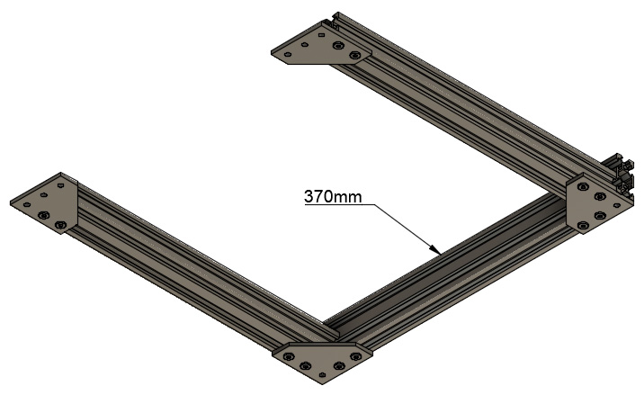

# McP Assembly Instructions

## Bones

### Parts  

* 1x 290mm v-slot
* 2x 331mm v-slots
* 2x 359mm v-slots
* 2x 370mm v-slots
* 16x M5x12mm screws
* 2x v-slot corner brackets

### Preparation

If you are assembling for "DIY Manufacture", all preparation steps except the last one have been done for you.

#### 370mm v-slots
1. The 370mm v-slots each need four holes drilled. All four are in the same channel, 10mm and 30mm from each end.

#### 359mm v-slots
1. The 359mm v-slots each need two holes drilled through the larger (40mm) thickness, 10mm and 30mm from one end.
1. Both center holes on the other end of the v-slots need to be tapped for M5 screws.

#### 331mm v-slots

1. The 331mm v-slots each need two holes drilled, one through each channel.  These should be 106mm from one end.
1. All four center holes on the ends of each v-slot need to be tapped for M5 screws.

#### 290mm v-slot

1. All four center holes on the end of this v-slot need to be tapped for M5 screws.
1. For those in "DIY Manufacture" one end is already tapped, you need to tap the other.  Tap as deep as the tap will go using the plastic tap/v-slot alignment guide.

### Assembly

1. Insert M5x12mm screws into the threaded ends of the 331mm v-slots.  You should use 8 screws.
1. Each screw should be about 3mm from fully screwed in so that each screw can be slid into a v-slot.

1. Arrange one 370mm v-slot and two 331mm v-slots as shown.  
\
*fig 1.3*
1. Make sure the holes in the 331mm v-slots are closer to the 370mm v-slot.

1. Use the 290mm v-slot to set the correct spacing and tighten the screws.
\
*fig 2.1*
1. Insert a v-slot nut into the top outside channel on each 331mm v-slot.
1. Insert M5x12mm screws into each of the four top channels in the 331mm v-slots.  The head of the screw should be trapped in the channel.  Align the screws above the holes in the v-slots.

1. Add the other 370mm v-slot to the other end of the 331mm v-slots.  Again use the 290mm v-slot to set the correct spacing and tighten the screws.

1. Make sure the base is flat so that all four corners can touch when placed on a flat surface.  Check the base is not twisted by pressing down each corner.
1. If it is twisted, place an object (in red on figure 4.2) under one corner and apply pressure simultaneously to both perpendicular corners (A and B). Repeat this for left and right side until you get a perfectly flat frame.
\
*fig 4.2*
1. Insert M5x12mm screws into the threaded ends of the 290mm v-slot.  You should use 4 screws.
1. Each screw should be about 3mm from fully screwed in so that each screw can be slid into a v-slot.
1. Assemble the upright by attaching the 290mm v-slot between the two 359mm v-slots as shown.
\
*fig 6.3*
1. Loosely tighten the screws to finish the upright.
1. Attach the upright to the base using the screws in the 331mm v-slot channels.  Use the 106mm plastic spacer to position the upright accurately.  Tighten the screws.
1. Your frame should now look similar to that shown in figure bones_finished.
\
*fig bones_finished* 
1. Make sure that each upright is 106mm from the back.
   :warning: important
1. Make sure the uprights are square to the base, in both directions.
   :warning: important
1. Make sure the crossbar is square to the uprights.
1. For improved rigidity, triangular corner braces should be added at the left and right edges of the upright.  Use the v-slot nuts that you inserted in the channels of the 331mm v-slots as well as two more that you slide in the 359mm v-slots.  Make sure they are on the back (shorter) side.
1. For more rigidity, more triangular corner braces can be added.  This step is optional.

### &nbsp;&nbsp;&nbsp; [Next Step: joints](joints.md)
