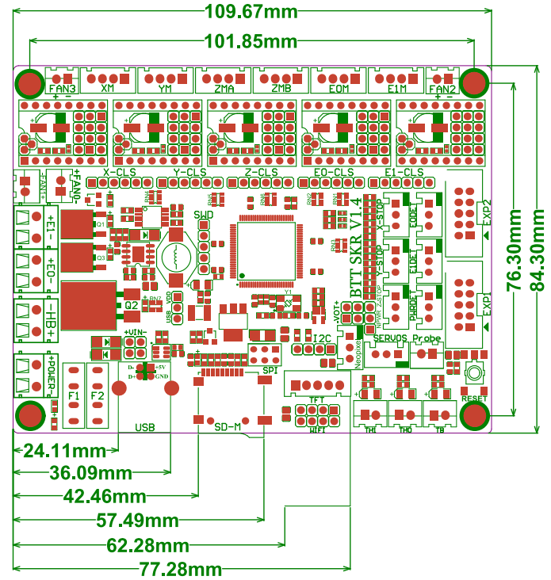
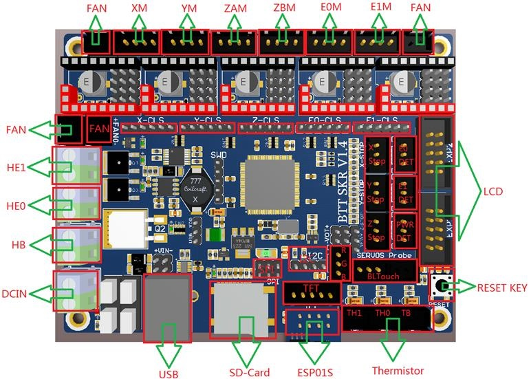
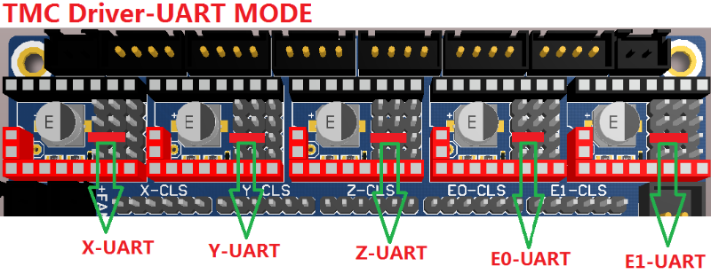
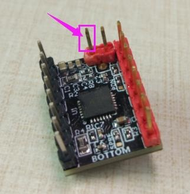
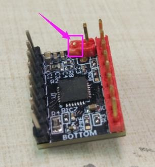
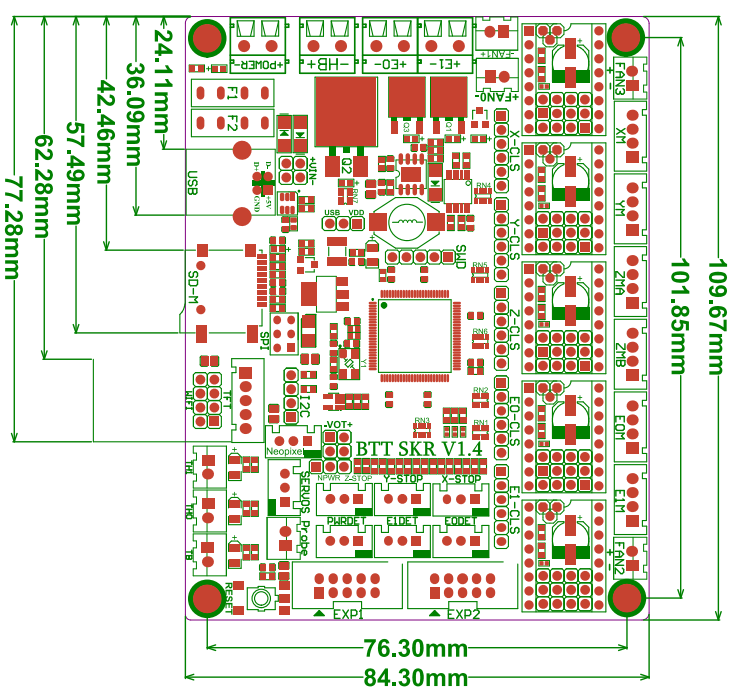

# McP Assembly Instructions: Brain (microcontroller)

## Step 1: Supplies

These are the supplies you need to assemble the power supply.

1. Microcontroller board (SKR 1.4)
1. 5x stepper drivers (BTT TMC2209)
1. assembled printer

This is what the board looks like:

The functions of most of the connectors are shown here:

## Step 2: Arrange jumpers

To use the stepper drivers in the UART mode (allowing microcontroller control of stepper functions), you need just one jumper for each driver as show below:

\

You will probably accomplish this by removing the first, second, and fourth jumpers for each driver.

## Step 3: Add heat sinks to stepper drivers

For each stepper driver (x5):
1. Peel the backing off the adhesive on the small aluminum heatsink.
1. Without touching the adhesive, place it over the gold pad on the top of the stepper driver.
1. Press down firmly.

## Step 4: Attach stepper drivers for X and Y

Mount the stepper drivers on the two leftmost sockets (those labeled X and Y in the above pictures).

The red pins will mount in red sockets and the black pins will mount in black sockets.

## Step 5: Prepare the Z and E drivers
Note: When using the TMC2209, when we don’t use the stallguard function (which we only use on X and Y), we need to cut off the DIAG pin on the driver so that the mechanical switch can work normally. 

The difference is shown below:

Original driver, configured for stallguard (X and Y):

\

Modified driver, configured for non-stallguard (Z1, Z2, E):

\

So for the remaining three drivers, use nippers to cut off the DIAG pin (the red pin on the short side that is closest to the middle).

## Step 6: Attach stepper drivers for Z1, Z2, and E

Mount the three stepper drivers that you just modified on the three rightmost sockets (those labeled Z, E0, and E1 in the above pictures).

The red pins will mount in red sockets and the black pins will mount in black sockets.

## Step 7: Load the brain box nut traps

Insert M3s square nuts into the nut traps in the brain box.

## Step 8: Attach brain

Using 4 M3x10mm screws and nuts, mount the microcontroller board in the brain box. (If you have them, M3x8mm screws would be better.) 
Make sure the board is oriented correctly; you can tell because the USB port will be accessible.

## Step 9: Mount brain box to frame

Use M5x8mm screws and v-slot nuts to mount the brain box to the frame (it sits behind the left upright when viewed from the face side).  You will probably want to leave the brain box only loosely attached.

## Step 10: Route x and bed cables

1. The x cable goes into the smaller hole in the top of the brain box.

1. The bed cable goes into the angled hol near the bottom of brain box.

## Step 11: Route extruder (hand) cable 

1. Insert the nylon cable stiffener into the hole in the feedthough for it on the top of the brain box.

1. Make sure the sleeve is inserted into  the cable feedthrough.

1. You may want to use a ziptie to hold the cable in place.

## Step 12: Connect wires

Connect all the wires using this picture for reference:

A. Heated bed to HB: + to +, - to -

B. Power to POWER: make sure + from PSU connects to + here (electrical standard is negative wire is marked (ribbed, grooved, or striped)).  Note that + for power is on the left, while + for the heated bed is on the right

C. Extruder heater cartridge to E0: the white woven insulated wires coming from the extruder cable, either polarity is fine

D. X motor to XM

E. Y motor to YM

F. Z1 motor (lead from left motor) to ZMA

G. Z2 motor (lead from right motor) to E1M !warning!

H. E motor to E0M

I. Extruder fan (orange wires) to FAN1

J. Extrusion cooling fan (blue wires) to FAN0

K. Heated bed thermistor to TB

L. Hotend thermistor to TH0: white wires with connector coming from extruder cable 

M. BLTouch servo (brown, red, yellow connector) to SERVOS

N. BLTouch sensor (black and white 3 pin connector) to NPWR Z-STOP

O. Ribbon cable #1 from face (LCD) to EXP1

P. Ribbon cable #2 from face (LCD) to EXP2

Q. Optional brain box cooling fan(s) to FAN3 (and FAN2)

## Step 13: Optional - Route the cables neatly

Try to manage the bird's nest of wires inside your brain box by printing and using some cable holders (Cable_Holder.stl and Cable_Holder_Short.stl) from Juan Puchol's [Universal BTT SKR V1.3, V1.4 & V2](https://www.thingiverse.com/thing:4178177) .

## Step 14: Add brain box cover

(If you are like me and you sometimes make mistakes, you may want to delay this step until you verify that things are working.)

If you have a cover for your brain box:
1. Place the cover in place over the brain box, there are tabs to direct it.
1. Close the cover and attach to the brain box with M3x10mm screws and one M3x25mm screw.  Be careful to not pinch, unplug, or short any wires. 
  
#### [Previous Step: face](face.md) &nbsp;&nbsp;&nbsp; [Next Step: awaken](awaken.md)
