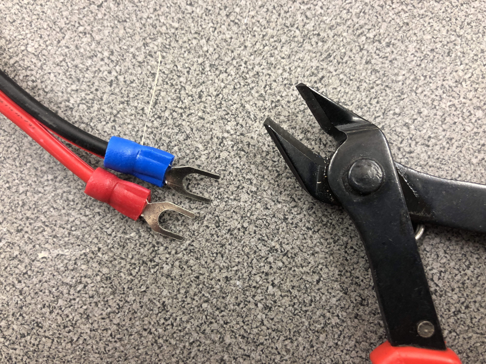
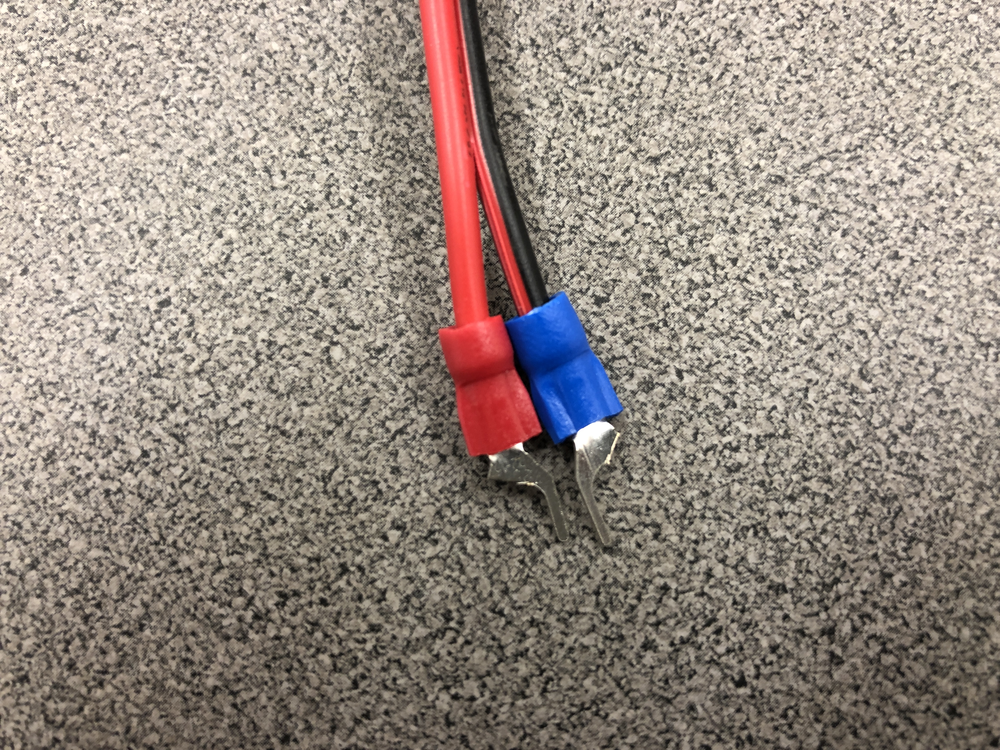
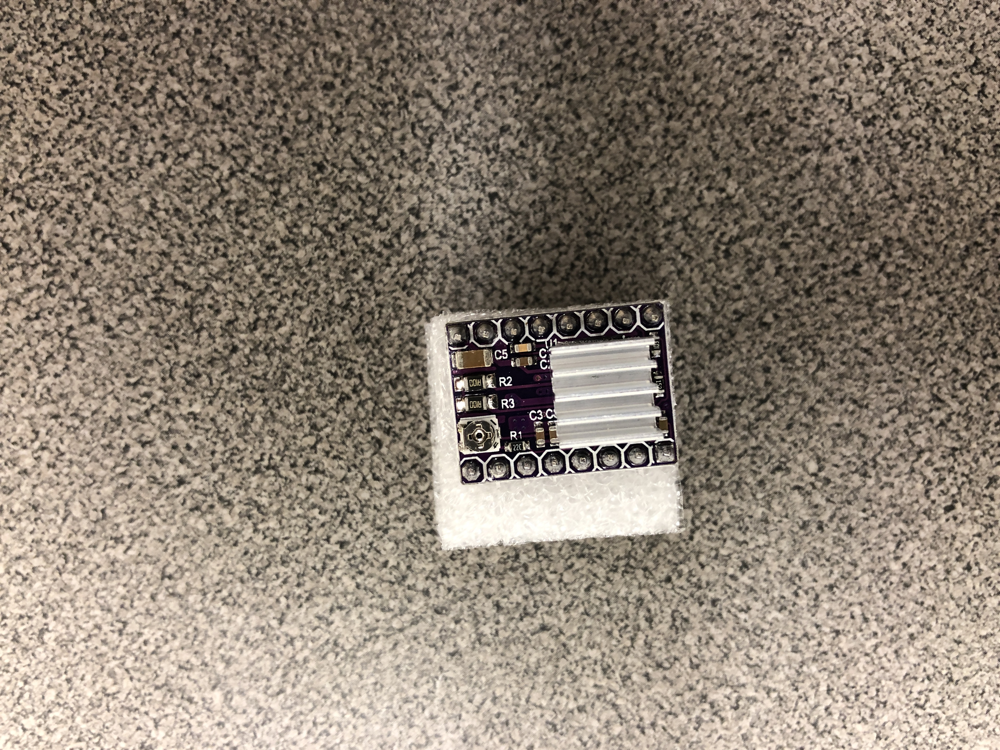
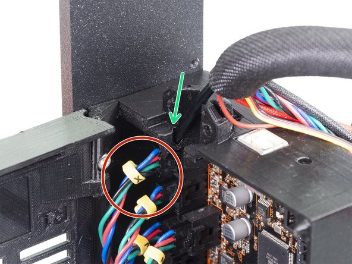
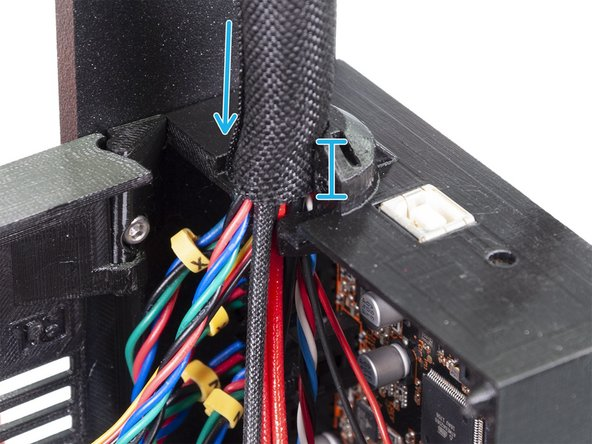
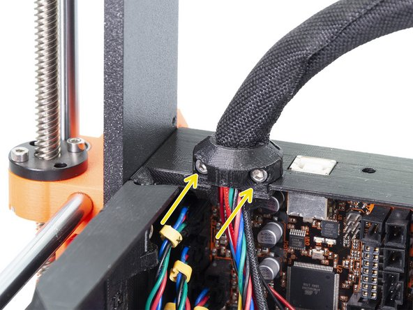
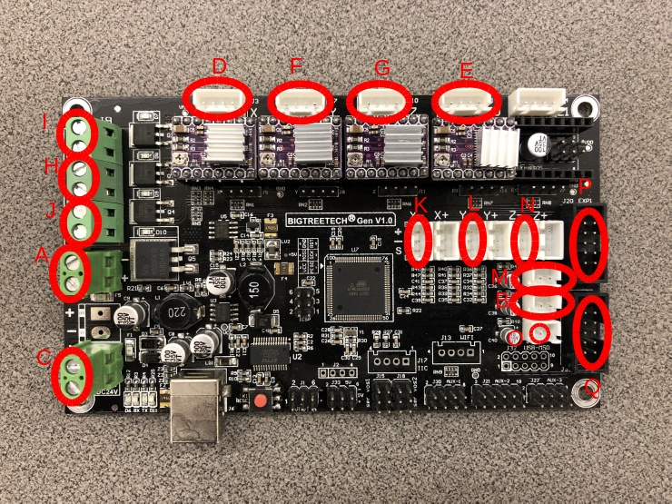

# McP Assembly Instructions: Brain (microcontroller)

## Step 1: Supplies

These are the supplies you need to assemble the power supply.

1. Microcontroller board
1. x12 jumpers
1. 4x stepper drivers
1. assembled printer

## Step 2: Prepare heatbed wires
\

You need to cut the ends of the heatbed wire connectors so tht they will fit into the microcontroller terminals.

\

## Step 3: Prepare inductive sensor connector

\

You will need to cut the connector of the inductive sensor so that the white wire is separate.

\

Once the white wire is separated, clean up the end of the connector so the plastic makes a clean end even with the raised piece. 
\

Done.  It is fine if no plastic remains on the end of the white wire.

## Step 4: Connect jumpers
\
Add 12 jumpers to the pins shown in the figure.

## Step 5: Add heat sinks to stepper drivers

For each stepper driver (x4):
1. Peel the backing off the adhesive on the small aluminum heatsink.
1. Without touching the adhesive, place it over the chip on the stepper driver.
1. Press down firmly.

\

## Step 6: Attach stepper drivers

Mount the stepper drivers on the microcontroller as shown.

\

Make sure the heatsinks are away from the green connectors.

## Step 7: Attach screws to frame

Attach two M5x8mm screws to the frame with slide in t-nuts.  They slide in the leftmost back slot in the upright.

## Step 8: Mount brain box

1. Mount the brain box using the screws from previous step, leaving both screws loose.
1. The brain box should sit as low as it can, resting on top of the corner connector. The outer edge of the brain box should be flush with the leftmost edge of the frame upright.
1. Tighten the upper screw, leaving the lower loose.

## Step 9: Route x cable

1. Rotate the brain box so that x cable can be routed between the brain box and the upright.
1. The x cable goes into the hexagonal hole in the edge of the brain box.
1. Rotate the brain box with the x cable so that the edge again is flush with the upright.
1. Make sure only a small amount (~1cm) of the sleeve is inside the brain box.
1. Tighten both of the M5 screws holding the brain box against the frame.

## Step 10: Attach brain

Using 4 M3x10mm screws and nuts, mount the microcontroller board in the brain box.  Make sure the green terminals are at the bottom.

## Step 11: Attach extruder (hand) cable 

\

1. Insert the nylon cable stiffener into the hole in the feedthough for it on the top of the brain box.

\

2. Make sure the sleeve is inserted into at least 3/4 of the height of the cable feedthrough.

\

3. With the printed piece, using 2 M3x10mm screws and 2 M3s square nuts, fix the cable bundle in place.

## Step 12: Connect wires

In order, connect all the wires as shown in this picture:
\

A. Heated bed: red to +, black to -

B. Heated bed thermistor: clip faces to right

C. Power: make sure + from PSU connects to + here (copper wire if you followed heart instructions).

D. X stepper

E. E stepper

F. Y stepper

G. Z stepper

H. Extruder heater cartridge: the white woven insulated wires coming from the extruder cable, either polarity is fine

I. Hotend fan: orange to +, white/orange striped to -

J. Nozzle fan: blue to +, white/blue striped to -

K. X endstop

L. Y endstop: should be red, black, green from left to right

M. Hotend thermistor: white wires with connector coming from extruder cable 

N. Inductive sensor: the connector that you cut white wire off. Should be brown, blue, black from left to right

O. The white wire from that connector: must connect with lower pin of 2

P. Ribbon cable #1 from face (LCD)

Q. Ribbon cable #2 from face (LCD)

## Step 13: Secure heated bed (belly) cable

1. With the printed piece, using 2 M3x10mm screws and 2 M3s square nuts, fix the heated bed cable bundle in place.  Make sure as much of the sleeve is outside the brain box as possible.

## Step 14: Add brain box cover

If you have a cover for your brain box:
1. Fill the nut slot in it with an M3s square nut.
1. Insert the tabs in the cover into the v-slot in the upright next to the brain box. 
1. Close the cover and attach to the brain box with an M3x40mm screw.  Be careful to not pinch, unplug, or short any wires. 
  
#### [Previous Step: face](face.md) &nbsp;&nbsp;&nbsp; [Next Step: awaken](awaken.md)
