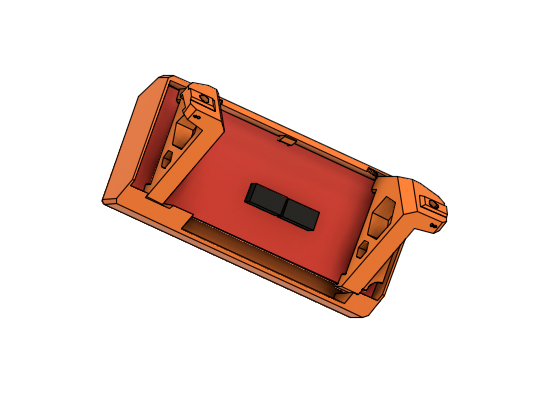
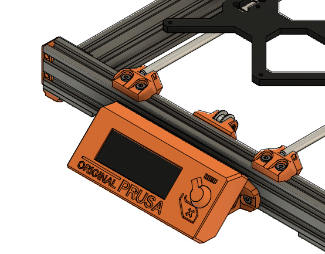

# McP Assembly Instructions: Face (LCD)

#### Parts  

* 1x RepRapDiscount Smart Controller
* 1x lcd_support_a
* 1x lcd_support_b
* 1x Screen cover
* 4x M3x8
* 2x M5x10
* 2x Tee nuts

#### Assembly

1. Slide the lcd supports onto the lcd.
1.  Remove the supports below the tooth on the back of the screen cover so that this tooth can hold the lcd.
1. Assemble the new lcd supports with the screen cover (figure 14.1).  M3x8 screws can help hold it securely.
1. Assemble the lcd to the frame with 2 M5x10 and 2 tee nuts (figure 14.2)

Note: the aluminum knob is too long to work (you need to be able to push and turn the knob), so you will need to either: a) use no knob, b) print a plastic knob, or c) cut about 6mm off your knob.

\
*fig 14.1*

\
*fig 14.2*

:warning: Often LCDs come with the key on the connectors reversed.  If your LCD does not light up when you first turn on your printer (in "awaken"), this is likely the problem.  The black housing on the electrical connector can then be reversed by carefully prying it off of the board, reversing it, and reapplying it.

(If you want to silence the long beep on startup, you need to electrically pull the buzzer down to ground.  This is accomplished by soldering a 10 kohm resistor between the right side of R1 (below "Discount") and ground: the left most connector pin in the line at the top (marked "K" from the face side).)

#### [Previous Step: wrist](wrist.md) &nbsp;&nbsp;&nbsp; [Next Step: brain](brain.md)
