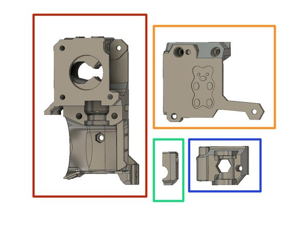
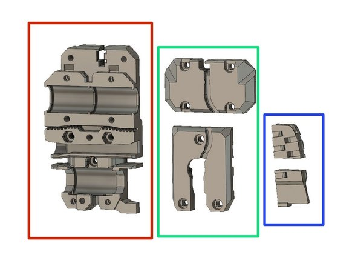
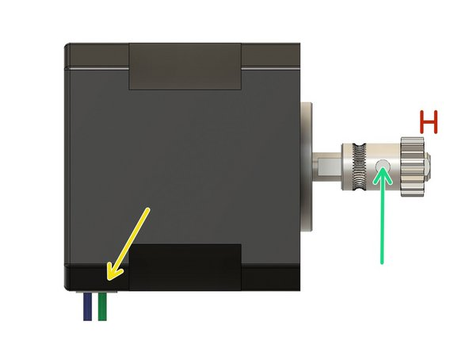
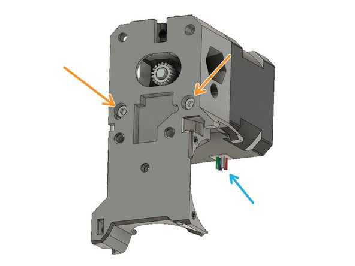
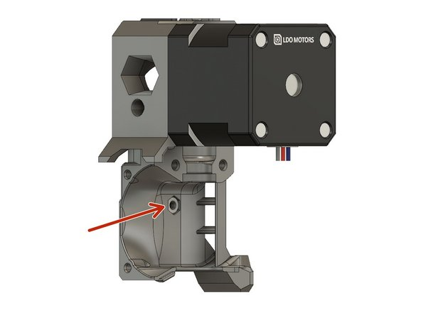
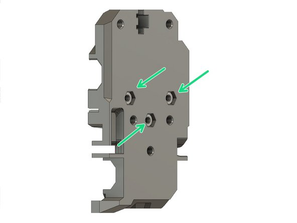
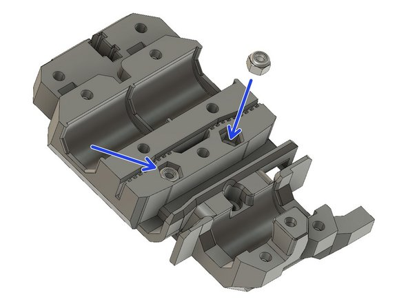
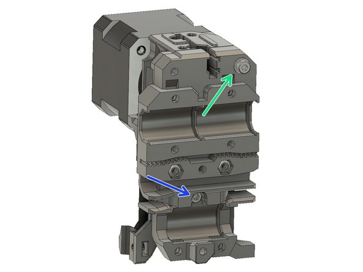
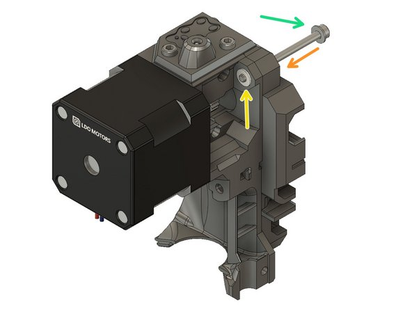

# McP Assembly Instructions: Hand (extruder)

## Step 1: How to insert nuts

Inserting Hex Nuts: To assure that hex nuts are properly seated, do the following:

1.   Insert a screw through a washer.

 1.   Insert the screw through the hole on the flat side (not the hex cavity side).

   1. Add the hex nut on the screw and tighten the screw.

   1. Ensure the hex nut is aligned with the hex cavity while tightening.

1.    When the nut is full seated, you may remove the screw being careful not to dislodge the nut.

Inserting Nyloc Nuts: You can use the same method as hex nuts.

Inserting Square Nuts: They tend to fall out if the piece holding them is inverted. After they are inserted, check that they are properly seated by inserting a screw to engage that nut.

## Step 2: Extruder parts 

red: extruder_body

orange: extruder_cover

blue: extruder_idler

green: pinda_mount

red: x_carriage

green: x_carriage_back

blue: cable_guide_back

## Step 3: Extruder motor 

Mount the Bondtech pulley on the extruder motor shaft with the toothed portion on top with the set screw contacting the flat portion of the shaft.

The motor shaft should extend approximately 1mm beyond pulley.

Secure the set screw to prevent the gear from moving. We will fine tune the position later.

Secure the extruder motor to the extruder_body using two M3x25 screws.  Cable mount should be on the right, not on the bottom as the picture shows.

## Step 4: Insert mounting nuts

Press an M3 hex nut into the extruder_body.

Insert 3 M3 nuts into the x_carriage.

Insert 2 M3 nylock nuts into the other side of the x_carriage.

## Step 5: Mount extruder on carriage

blue: Using an M3x10 screw, attach the extruder_body to the x_carriage.
green: Using an M3x40 screw and an M3 washer, attach the extruder_body to the x_carriage.

## Step 6: Extruder idler preparation

Slide two Bondtech needle bearings on the 3x20mm shaft

Lubricate the needle bearings with a dab of lithium based grease

Place the idler gear into the extruder_idler. Note the orientation of the teeth.

Insert the shaft from the direction shown as on the figure.

Insert a square nut in available pocket.

## Step 7: Extruder idler assembly

Slide an M3x40 screw with an M3 washer into the carriage.

Add the extruder_idler in the opening.

Push the screw all the way in.

Slightly tighten the screw, the extruder_idler must rotate freely.

#### [Previous Step: nerves](nerves.md) &nbsp;&nbsp;&nbsp; [Next Step: senses](senses.md)