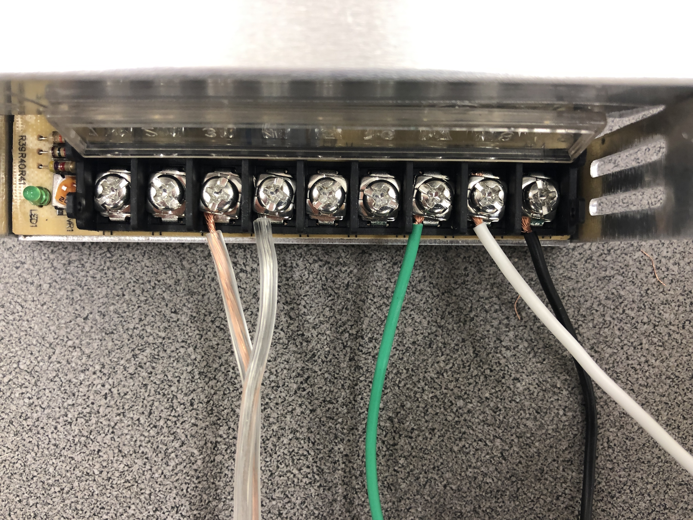
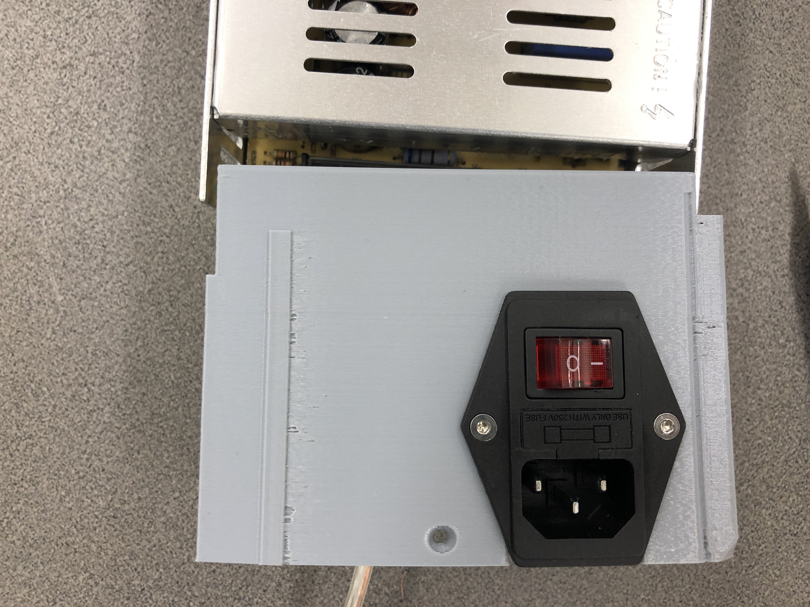
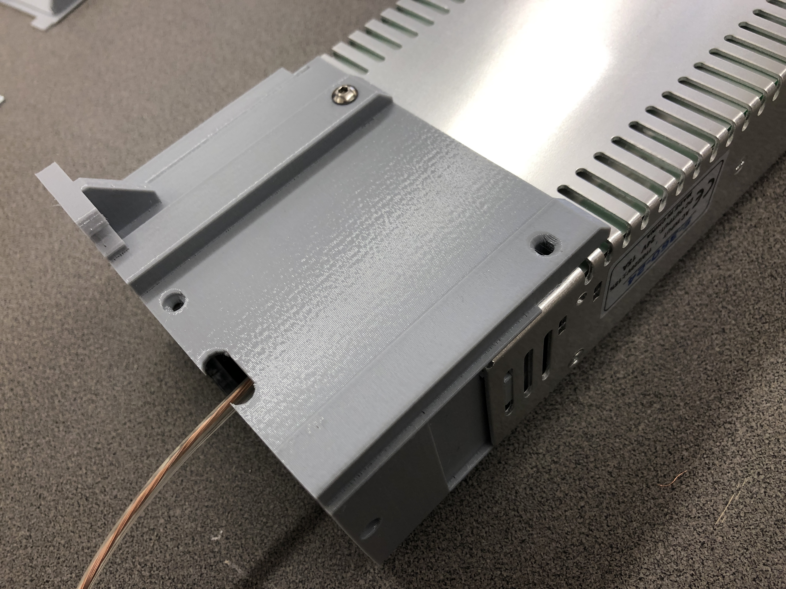
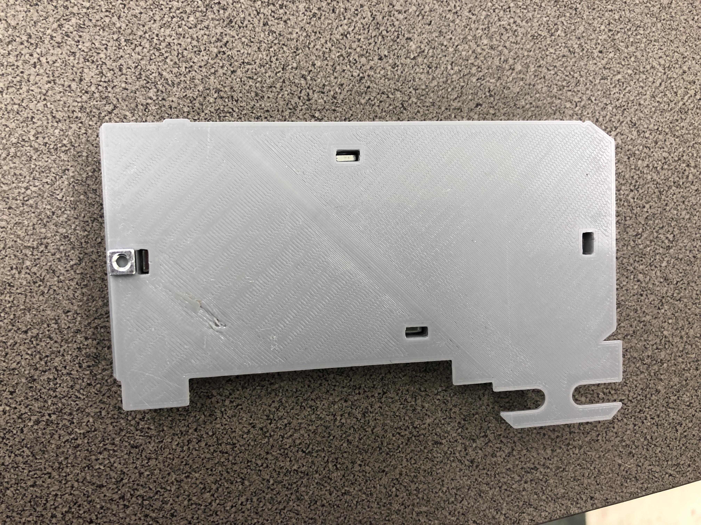
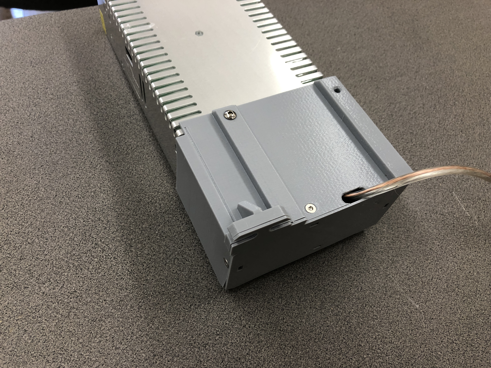

# McP Assembly Instructions: Heart (power supply)

## Step 1: Supplies

These are the supplies you need to assemble the power supply.
\
1. PSU
1. PSU_cover
1. fused switch
1. 700mm power cord 
1. 6 M3 flathead screws
1. 2 M3 hex nuts
1. 1 M4 screw
1. 4 M3 square nuts
1. PSU_base

## Step 2: Attach wires

\

Loosen the attachment screws, insert the wires as shown, and tighten the attachment to pinch the wire firmly.

Double check that all wires are connected to the correct terminal: coppery to V+, silvery to V-, green to ground, white to N, black to L.   

## Step 3: Put together

1. Slide the PSU_cover over the wires and switch.

1. Place the switch in the cutout in the PSU_cover.
\

1. Attach the switch with 2 M3 flathead screws and 2 M3 hex nuts.

1. Slide the PSU_cover over the PSU, so that the screw holes near the top of the cover line up with the tapped holes in the PSU.
\
1. Screw in the M4 nut to attach PSU_cover to PSU.

1. Fill nut traps in PSU_base.
\

1. Place PSU_base on PSU_cover and attach with M3 flathead screws.
\

#### [Previous Step: hand](hand.md) &nbsp;&nbsp;&nbsp; [Next Step: feet](feet.md)
