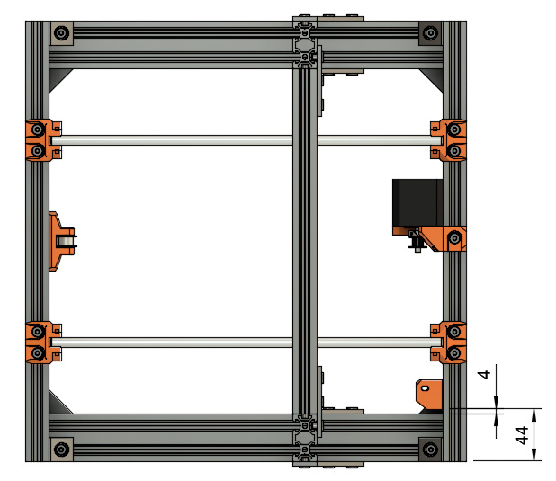
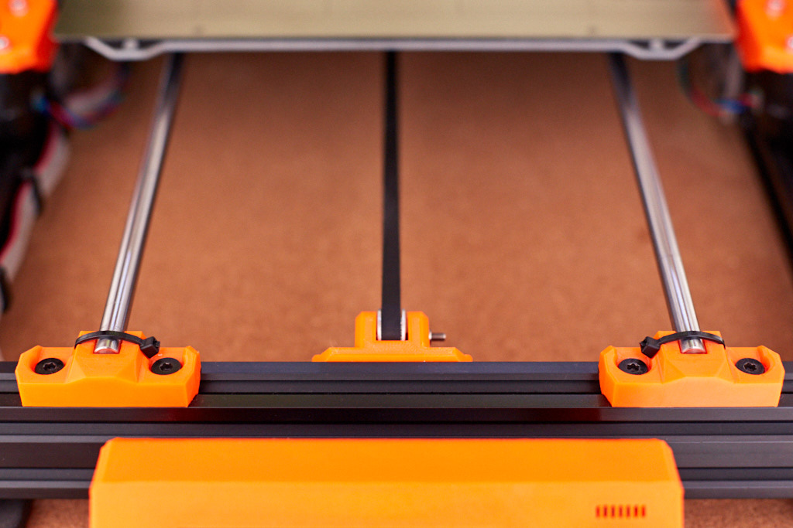

# McP

## Assembly Instructions

### Joints y1

#### Parts  

* 4x rod_holder
* 2x Y smooth rods (320mm)
* 8x M5x12mm screws
* 9x Tee nuts

#### Assembly

1. Assemble 2x rod holders on the right side of the frame with 4x M5x12 and 4x tee nuts (figure 8.1).
1. Adjust to match dimensions as seen on figure 8.1.
1. Add a smooth rod on these two holders.
1. Check the rod is perpendicular to the front and back of the frame with a square (figure 8.2). To check the rod is perpendicular to top v-slot, put the frame on the ground, the square in the middle and look from top 
   :warning: this step is very important, double check everything
1. Add a tee nut on the back (for y_motor_mount) as seen on figure 8.2
1. Assemble 2 other rod holders on the left side of the frame with 4x M5x12 and 4x tee nuts (figure 8.3)
1. Assemble the second smooth rod and verify all dimensions as explained on figure 8.3 
   :warning: this step is very important, double check everything

\
*fig 8.1*

\
*fig 8.2*

\
*fig 8.3*

### Joints y2

#### Parts  

* 1x y_idler
* 1x psu_lower_mount
* 1x y_motor_mount
* 1x Y motor
* 3x M3x10 screws (2x from original Y motor mount, 1 from original Z motor mount)
* 3x M5x10mm screws
* 2x M5x12mm screws

#### Assembly

1. Screw the y_motor_mount on the back of the frame using 2x M5x12 and adjust to the dimensions in figure 9.1
1. Assemble the Y motor on the y_motor_mount with 3x M3x10 screws (figure 9.2). Ensure the correct orientation of motor cables
1. Screw the y_idler using 2x M5x10 and adjust to the dimensions in figure 9.3.
1. Ensure the correction orientation of y_idler, the nut should be on the same side as the single Y axis bearing
1. Screw the psu_lower_mount to the top half of the extrusion using 1x M5x10 and adjust to the dimensions in figure 9.4

\
*fig 9.1*

\
*fig 9.2*

\
*fig 9.3*

\
*fig 9.4*

### Joints y3

#### Parts  

* 1x heated bed assembly
* 4x zip ties

#### Assembly

:heavy_exclamation_mark: Y belt is not visible in these figures and will not be visible in the following ones

1. Unclip the front of y smooth rods
1. Slide carefully the Y carriage. Ensure correct orientation as highlighted in figure 10.1
1. Clip back Y smooth rods
1. Add zip ties with head facing inside the frame as seen on figure 10.2. Ensure zip ties are not touching the bed and y carriage
1. If the bed does not slide smoothly, improve rod spacing/angle 
   :warning: this step is very important, take your time and check dimensions from [step 9](step09.md)
1. Unscrew 2x M3x10 bottom screws of the y_motor_mount as highlighted in figure 10.3
1. Rotate the motor and mount the Y belt
1. Find the correct tension for the belt. You can use the Prusa MK3 method from the original manual here : [Step 37 Testing the Y-axis belt](http://manual.prusa3d.com/Guide/2.+Y-axis+assembly/507?lang=en#s8300)
1. Screw the motor back
1. Take your time to perfectly align y_idler and y_motor_mount to get a good belt alignment

\
*fig 10.1*

\
*fig 10.2*

\
*fig 10.3*

### Joints z1

#### Parts  

* 2x z_motor_mounts
* 6x M5x10mm screws
* 6x Tee nuts
* 2x Z leadscrew
* 2x Z leadscrew couplers

#### Assembly

1. Assemble 3x M5x10 screws with 3x tee nuts on each z_motor_mount
1. Slide from top the z_motor_mounts on the Z axis (figure 11.1). Ensure the smooth rods holes are facing outside
1. Ensure z_motor_mounts are touching the bottom horizontal v-slot and they are at 90° compared to vertical v-slot (figure 11.2)
1. Tighten strongly all M5x10 screws
1. Mount the Z leadscrews and Z leadscrew couplers on the Z motors.  Couplers need to be mounted with their bottom below the top of the Z mount.  Tighten the setscrews.

\
*fig 11.1*

\
*fig 11.2*

### Joints x
1. Assemble the x-axis

### Joints z2

#### Parts  

* 2x z_motor_fronts
* 8x M3x12mm screws
* 8x M3 washers (from original printer)
* 1x X axis
* 2x Z motors
* 2x Z smooth rods (320mm)

#### Assembly

:heavy_exclamation_mark: X axis is not visible in these figures and will not be visible in the following ones

1. Assemble X axis on both Z motors (move it approximately in the middle of Z axis)
1. Use 8x M3 washers, 8x M3x12 screws and 2x z_motor_fronts to mount Z motors on the z_motor_mounts (with the X axis mounted) (figure 12.1). 1. Ensure the motor cables are facing the Y smooth rods
1. Push Z smooth rods carefully in the holes until your hear them touching the motors (figure 12.2)

\
*fig 12.1*

\
*fig 12.2*

### Step 13

#### Parts  

* 2x z_tops
* 4x M5x10 screws
* 4x Tee nuts

#### Assembly

1. Assemble 2x M5x10 screws with 2x tee nuts on each z_top
1. Slide from top the z_tops and insert the Z smooth rods in the appropriate hole (figure 13.1)
1. Push strongly the z_tops in order to have the Z smooth rods touching the top of the rod hole (figure 13.2)
1. Ensure that top of z_tops are perpendicular to vertical v-slots
1. Tighten strongly all M5x10 screws

\
*fig 13.1*

\
*fig 13.2*

#### [Previous Step](bones.md) &nbsp;&nbsp;&nbsp; [Next Step](nerves.md)

