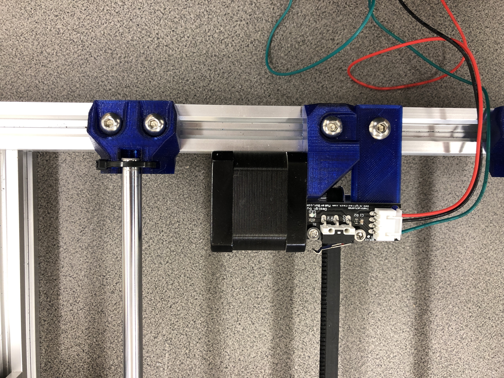
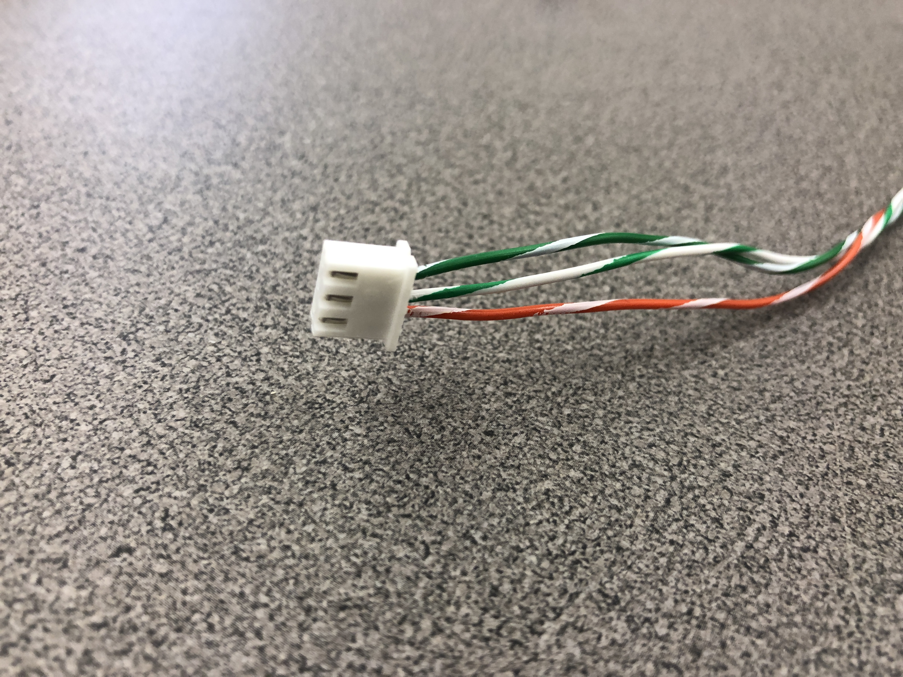
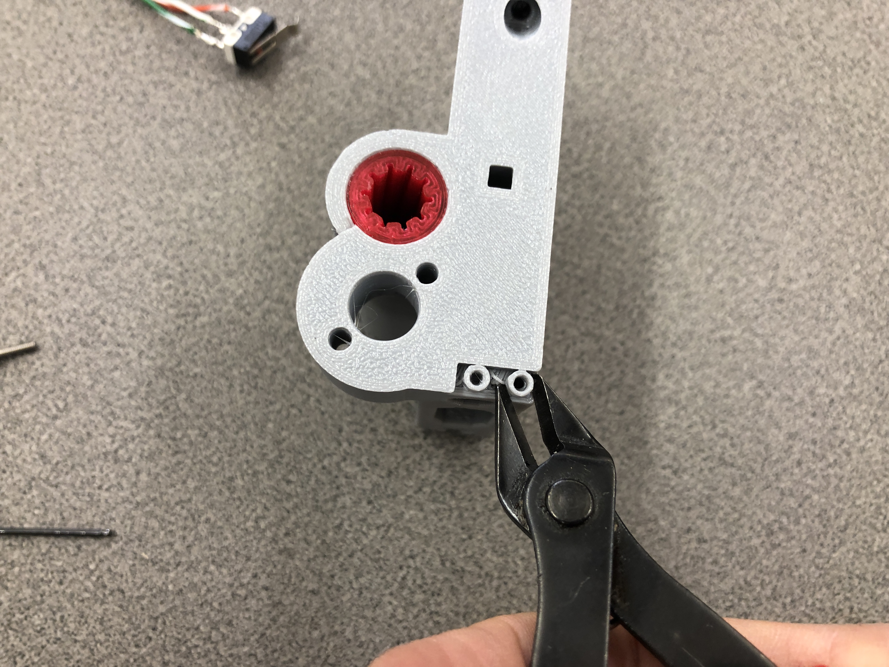

# McP Assembly Instructions: Senses (endstop detectors)

## Step 1: y_endstop

These are the supplies you need to mount the y_endstop.
\

Attach the mount to the aluminum rail next to the y_motor_mount using M5x8 screws and t-slot nuts.

Attach the switch to the mount using the M3x10 screws.

Connect the wiring connectors.

The completed setup should look like this.

\

## Step 2: Prepare x_endstop

Here are the supplies you need:
\
The three wires you need are 450mm long.

You need to remove the circuit board to get this:
\

First cut the switch off of the circuit board it is mounted on, leaving the wires as long as possible.

Then un-bend the wires so they are straight. 

Then solder the colored wires to the switch as shown.   
\

You need to add a 3 pin XH connector to the other end as shown.

\

## Step 3: Mount x_endstop

These are the supplies you need

\

\

First cut the small plastic circles from your x_motor_mount.

\

Then mount the x_endstop using 2 M2 screws.  It may be necessary/helpful to ream out the holes slightly before you insert the M2 screws.

#### [Previous Step: hand](hand.md) &nbsp;&nbsp;&nbsp; [Next Step: heart](heart.md)
