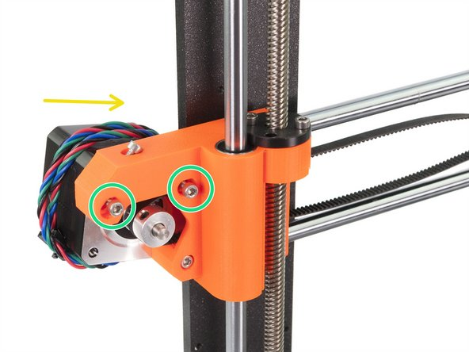

# McP Assembly Instructions: Wrist (attaching extruder to x-axis)

## extra supplies needed

1. 850mm GT2 toothed belt (cut to length needed).
1. Nylon filament, 3mm diameter, 520mm length.
1. Textile cable sleeve, 8mm diameter, 500mm length (the larger diameter sleeve).

## Follow the Bear instructions
Follow the instructions for the bear extruder and x-axis: [Bear extruder x-axis assembly](https://guides.bear-lab.com/Guide/4.+Extruder+and+X+axis+assembly/6)

Skip steps 3 and 8.

## Belt tension

When complete, make sure that all the wires and the nylon filament are inside the whole length of the sleeve.  Gently twist the sleeve to make it smaller and tighter around the cables.

Now we will correctly tension the x-belt.

\

Release two M3 screws on the X-end.

Rotate the X-axis motor as indicated towards the frame.

Insert the flat part of the X-GT2 belt into the X-carriage.

Using right hand rotate the motor to its original position and hold it (tension is applied to the belt).

Using two fingers on your left hand push the belt together. Very small force should be needed for bending the belt, BUT the belt shouldn't be bent by its own weight before being pressed with your fingers, it must be straight.

If you are struggling to rotate the motor back into position the belt tension is too high.

Depending on the belt being under or overstretched, adjust the amount of the belt in the X-carriage.

When done, rotate the motor to its original position and tighten the M3 screws again.

Slightly release all the screws holding the motor, otherwise, the upper "tensioner" won't work (the motor must be able to move).

ATTENTION !!! BE EXTREMELY CAREFUL WHILE TIGHTENING, YOU CAN CRACK THE PART IF YOU OVERTIGHT THE SCREW.

Using Allen key start tightening the M3x18 screw inside the X-end-motor, but after each turn or two check the tension in the belt.

For the optimal performance, the belt must not be too easy to press together with your fingers. Move the X-carriage all the way to the X-end-idler and try the belt tension in the middle of the X-axis.

When you achieve optimal tension, please tighten the screws again.

In case you experience X-axis failure during calibration or skipped layers in the X direction, you can adjust this screw accordingly. Tightening the screw stretches the belt. Releasing the screw has opposite effect. Each time don't forget to release the screws on the motor first.

#### [Previous Step: belly](belly.md) &nbsp;&nbsp;&nbsp; [Next Step: face](face.md)

